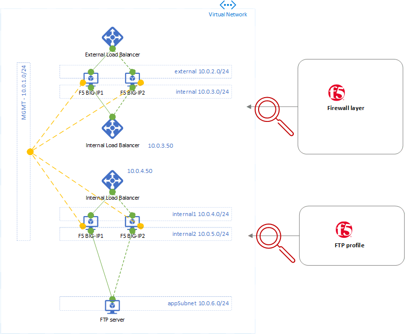
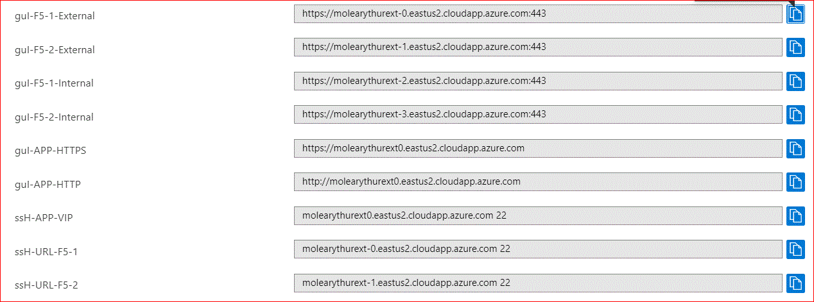

# azure-f5-lb-ftp
## Summary
Deploys a demo FTP server protected by HA pair of F5 behind Azure ALB. 2 tiers of network appliances protect the app server. The external tier is intended to emulate a firewall tier, where a customer could replace these devices with a firewall vendor of their choosing.

## Requirements
- 2x eval keys for BIG-IP (external pair, firewall)
- 2x eval keys for BIG-IP (internal pair, load balance, traffic mgmt, FTP profile)
- AS3 declarations for BIG-IP configuration of each tier, or, use default values to configure the architecture above with application traffic allowed on ports 80, 443 (web apps), 22 (ssh to the default app server), and 21 & 5000-5003 (demo FTP app).

## Deploy
  
  
## Verify
### Verify F5 config
When the Azure deployment completes, the output will contain multiple URL's. Use these to inspect the configuration of the BIG-IP devices using the UI over HTTPS, or console over SSH. 

### Verify application
There is also a URL for the app that is deployed and protected by BIG-IP. Visit this URL and inspect your IP headers and other information about your connection. It may take a few mins (approx 5 mins) after the Azure deployment has completed for the application to be up and running, and reachable via the URL provided in the outputs.
- the web app should be available over HTTP and HTTPS a few minutes after deployment
- the FTP site should be available via both Active and Passive FTP
  - remember that some FTP clients behave differently than others. In my testing I primarily used FileZilla to successfully test Active and Passive FTP connections after a fresh deployment.
- by default, the FTP site allow Read access, not Write access. To change this, SSH to the app server and edit /etc/vsftp.conf. If you don't know how to do this, set up your FTP server of choice within your Azure environment.

## Questions and Comments
Please raise a GitHub issue if you'd like this demo extended for other use cases!
